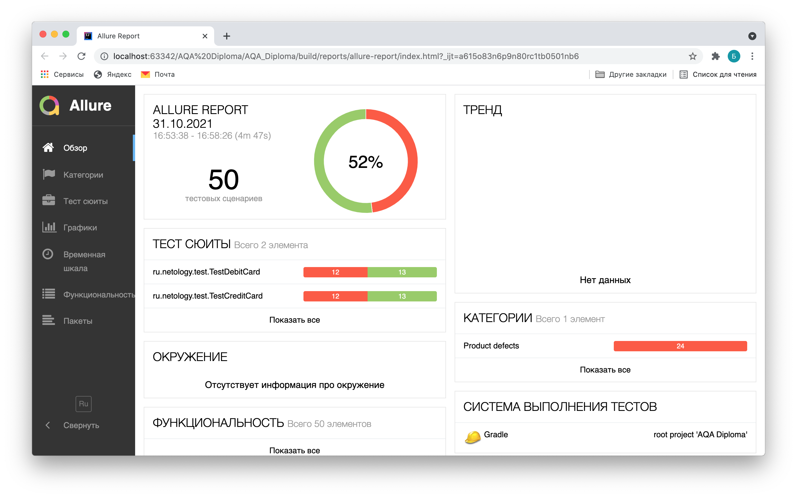
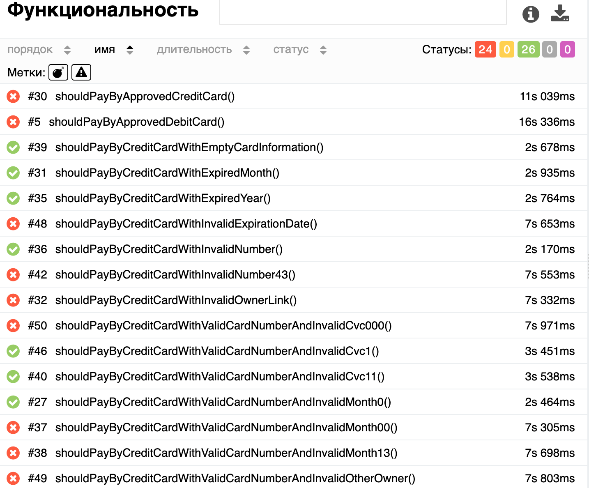
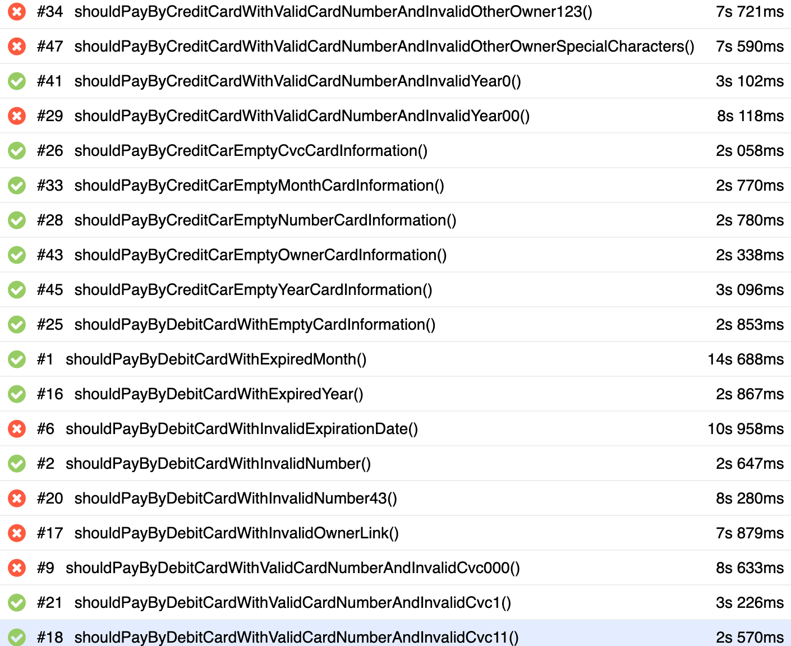
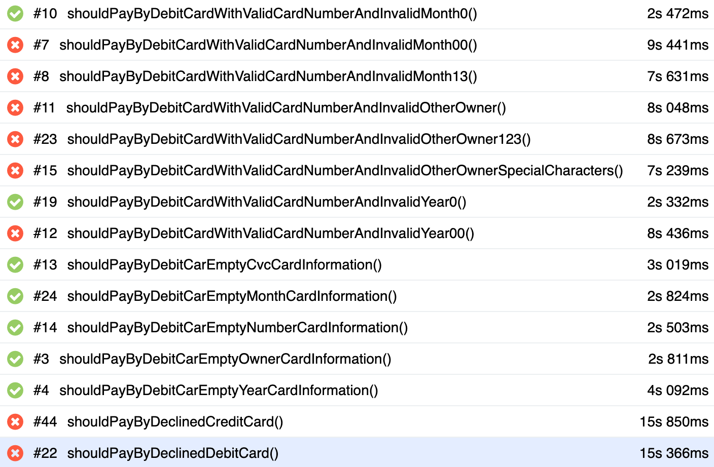

# Отчет по итогам тестирования

### Краткое описание

В ходе работы над проектом было проведено тестирование веб-сервиса "Путешествие дня", которое представляет из себя комплексный сервис, взаимодействующий с СУБД банка.

На первом этапе было проведено исследовательское тестирование для ознакомления с проектом. После написания автотестов было проведено автоматизированное тестирование сервиса, включающее в себя [проверку позитивных и негативных сценариев покупки тура](https://github.com/BudnikovaNastiya/QA-Diploma/blob/master/docs/plan.md), тестирование UI, БД.

Тестирование проведено для двух БД - MySQL и PostgreSQL.

### Количество тест-кейсов

Общее количество тест-кейсов - 50 (4 позитивных, 46 негативных)

**% успешных/неуспешных:** 52% / 48%

  На скриншотах ниже представлены отчеты Allure по итогам тестирования:

  
  
  

### Найденные дефекты

В результате тестирования приложения выявлены следующие дефекты:
* [Список дефектов](https://github.com/BudnikovaNastiya/QA-Diploma/issues)

### Общие рекомендации:

* Создать документацию для данного приложения.
* Исправить [дефекты](https://github.com/BudnikovaNastiya/QA-Diploma/issues).
* Добавить изменение цвета кнопок "Купить" и "Купить в кредит" при переключении между двумя вкладками для удобства пользователя.
* Заменить предупреждения "Неверный формат" на более информативные.

